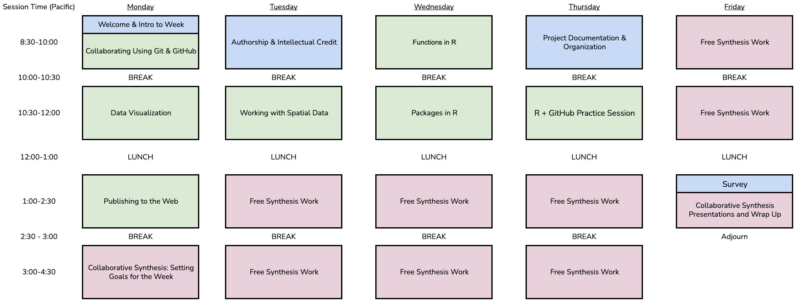

::: column-margin
:::

## Overview

The [Delta Science Program](https://deltacouncil.ca.gov/delta-science-program/){.external target="_blank"} is once again partnering with the [National Center for Ecological Analysis and Synthesis](https://www.nceas.ucsb.edu/){.external target="_blank"} (NCEAS) to convene a collaborative data synthesis working group in the spring of 2026. Delta Synthesis Working Groups receive advanced data science and statistics training with immediate opportunities to use those newly acquired skills to analyze available data and produce relevant research and data products. The upcoming working group will be the third cohort held through this partnership.

## Learning Objectives

:::{.callout-learning}

After completing this workshop, you will be able to:

- Use tidy data practices to effectively manage data
- Identify best practices and tools for optimizing collaboration (like Git & GitHub)
- Implement reproducible scientific workflows throughout all aspects of a project
- Summarize scientific analyses and results clearly and effectively by using computational notebook files, GitHub webpages, and R packages like `ggplot2` and `shiny`
:::

## Course Schedule

_Table Color Legend:_  Technical Topic;  Non-Technical Topic;  Synthesis Work

:::{.panel-tabset}
### Week Visual

{fig-alt="Screenshot of visual version of schedule. All information is also included in the table version of the schedule" .lightbox}

### Day 1

| Day | Time | Module Name | Primary Instructor |
|:--:|:-------:|:-------------------|:------------|
| 1 | 8:30 - 9a | **Welcome & Intro to Week** | - |
| 1 | 9 - 10a |  **Collaborating Using Git & GitHub** | TBD |
| 1 | 10 - 10:30a | _Break_ | - |
| 1 | 10:30 - 12p |  **Data Visualization** | TBD |
| 1 | 12 - 1p | _Lunch_ | - |
| 1 | 1 - 2:30p |  **R + GitHub Practice Session** | TBD |
| 1 | 2:30 - 3p | _Break_ | - |
| 1 | 3 - 4:30p |  **Free Synthesis Work   (Set Goals for the Week)** | - |

### Day 2

| Day | Time | Module Name | Primary Instructor |
|:--:|:-------:|:-------------------|:------------|
| 2 | 8:30 - 10a |  **Authorship & Intellectual Credit** | TBD |
| 2 | 10 - 10:30a | _Break_ | - |
| 2 | 10:30 - 12p |  **Working with Spatial Data** | TBD |
| 2 | 12 - 1p | _Lunch_ | - |
| 2 | 1 - 2:30p |  **Free Synthesis Work** | - |
| 2 | 2:30 - 3p | _Break_ | - |
| 2 | 3 - 4:30p |  **Free Synthesis Work** | - |

### Day 3

| Day | Time | Module Name | Primary Instructor |
|:--:|:-------:|:-------------------|:------------|
| 3 | 8:30 - 10a |  **Functions in R** | TBD |
| 3 | 10 - 10:30a | _Break_ | - |
| 3 | 10:30 - 12p |  **Packages in R** | TBD |
| 3 | 12 - 1p | _Lunch_ | - |
| 2 | 1 - 2:30p |  **Free Synthesis Work** | - |
| 2 | 2:30 - 3p | _Break_ | - |
| 2 | 3 - 4:30p |  **Free Synthesis Work** | - |

### Day 4

| Day | Time | Module Name | Primary Instructor |
|:--:|:-------:|:-------------------|:------------|
| 4 | 8:30 - 10a |  **Project Documentation   & Organization** | TBD |
| 4 | 10 - 10:30a | _Break_ | - |
| 4 | 10:30 - 12p |  **Publishing to the Web** | TBD |
| 4 | 12 - 1p | _Lunch_ | - |
| 4 | 1 - 2:30p |  **Free Synthesis Work** | - |
| 4 | 2:30 - 3p | _Break_ | - |
| 4 | 3 - 4:30p |  **Free Synthesis Work** | - |

### Day 5

| Day | Time | Module Name | Primary Instructor |
|:--:|:-----:|:----------------------|:---------|
| 5 | 8:30 - 10a |  **Free Synthesis Work** | - |
| 5 | 10 - 10:30a | _Break_ | - |
| 5 | 10:30 - 12p |  **Free Synthesis Work** | - |
| 5 | 12 - 1p | _Lunch_ | - |
| 5 | 1 - 1:15p |  **Survey** | - |
| 5 | 1:15 - 2:30p |  **Synthesis Work: Planning Next Steps** | - |
| 5 | 2:30 - 3p | _Adjourn_ | - |

:::

## Code of Conduct

By participating in this activity you agree to abide by the [NCEAS Code of Conduct](https://www.nceas.ucsb.edu/sites/default/files/2021-11/NCEAS_Code-of-Conduct_Nov2021_0.pdf){.external target="_blank"}.

## About this book

These written materials are the result of a continuous and collaborative effort at NCEAS to help researchers make their work more transparent and reproducible. This work began in the early 2000's, and reflects the expertise and diligence of many, many individuals. The primary authors are listed in the citation below, with additional contributors recognized for their role in developing previous iterations of these or similar materials.

This work is licensed under a [Creative Commons Attribution 4.0 International License](http://creativecommons.org/licenses/by/4.0/){.external target="_blank"}.

**Citation:** Casey O'Hara, Nick J. Lyon & Jim Regetz (2026), NCEAS Synthesis Skills Training for the Delta Science Program, April 2026, NCEAS Learning Hub. [nceas-learning-hub.github.io/2026_delta_week1](https://nceas-learning-hub.github.io/2026_delta_week1/){.external target="_blank"}.

**Content contributors:** Ben Bolker, Amber E. Budden, Julien Brun, Angel Chen, Samantha Csik, Halina Do-Linh, Natasha Haycock-Chavez, S. Jeanette Clark, Julie Lowndes, Stephanie Hampton, Matt Jones, Samantha Katz, Nick J. Lyon, Erin McLean, Bryce Mecum, Casey O'Hara, Deanna Pennington, Karthik Ram, Jim Regetz, Tracy Teal, Camila Vargas Poulsen, Daphne Virlar-Knight, Leah Wasser.

This is a Quarto-built website. To learn more about Quarto sites visit [https://quarto.org/docs/websites/](https://quarto.org/docs/websites){.external target="_blank"}.
