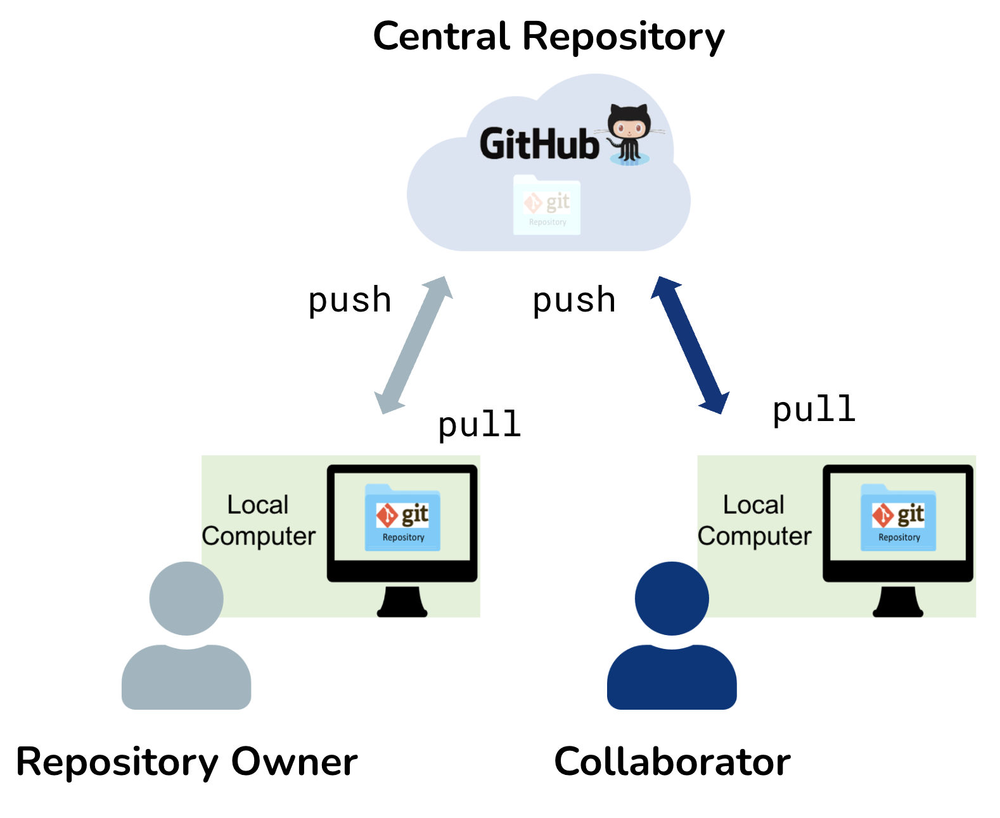
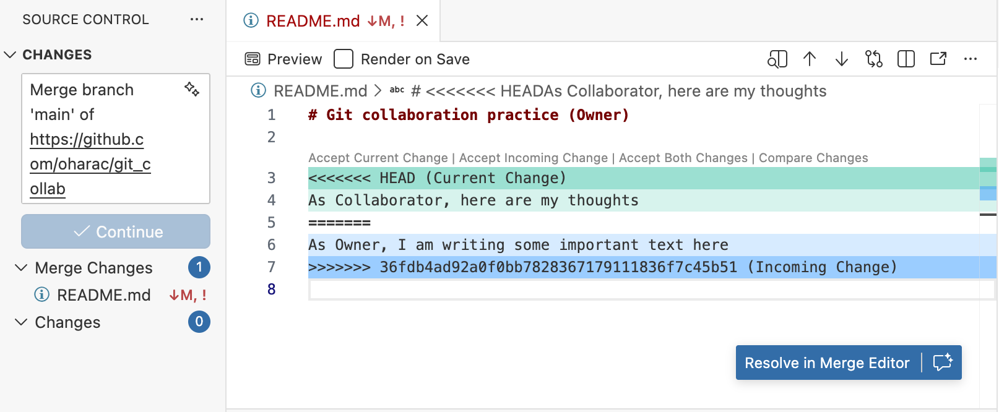
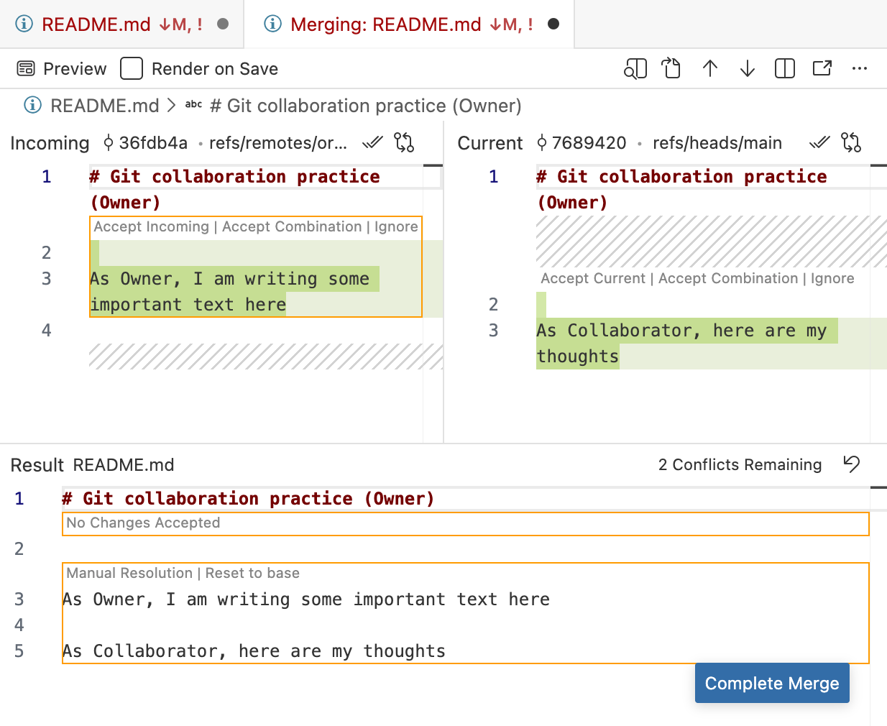
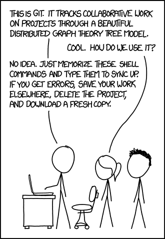

:::{.callout-learning}
After completing this session, you will be able to:

- Describe common causes of conflicts that arise when collaborating on repositories 
- Resolve conflicts using Git conflict resolution techniques
- Apply workflows and best practices that minimize conflicts on collaborative repositories
:::

## Introduction to Git and GitHub Tools for Collaboration

{width="70%" fig-align="center" .lightbox}

Git is a powerful tool for both individual and collaborative work. The most common way to collaborate is through a **shared repository on [GitHub](https://github.com){target="_blank" .external}**, which acts as a central hub where teammates can exchange and merge changes. In this lesson, one person (the **Owner**) hosts the repository on GitHub and grants a colleague (the **Collaborator**) permission to push changes directly.

{width="70%" fig-align="center" .lightbox fig-alt="Diagram showing the relationship between the Owner, Collaborator, and GitHub repository. The Owner has a local repository and a remote repository on GitHub. The Collaborator has a local repository that is connected to the remote repository on GitHub. Both the Owner and Collaborator can pull changes from GitHub to their local repositories and push changes from their local repositories to GitHub."}

Before diving into the exercise, keep these tips in mind - we'll return to them throughout:

* Start every work session with a Pull, and Pull occasionally throughout (to ensure you are up to date with your collaborator's changes!)
* Save → Stage (Add) → Commit -> Pull -> Push (Sync) your work throughout the session, in small logical chunks (so your changes are available to your collaborator!)

And the single most effective conflict-prevention strategy: **communicate with your collaborators** before and after making changes. Knowing who is editing which files, and when, eliminates most problems before they start.

:::callout-note
## Pull --> push vs Sync

The RStudio IDE uses the terms *Pull* and *Push* for Git operations, while the Positron IDE uses *Sync* to encompass both pulling and pushing changes. Because the underlying Git operation is *pull* --> *push*, we will use this terminology instead of *sync.*
:::


## Collaborating without conflicts

### Demonstration

We start with the ideal scenario: two collaborators taking turns, working on the same repo without ever editing the same lines simultaneously.  

Here, the instructors will demonstrate.  In the following exercise, the participants will pair up and try it themselves.

1. [**Owner**]{style="color: orange;"} adds [**Collaborator**]{style="color: purple;"} on GitHub{.unnumbered}
    * [**Owner**]{style="color: orange;"} creates a new repository on GitHub, called "git_collab_<username>" (or similar), and includes a README.  
    * Then, [**Owner**]{style="color: orange;"} navigates to the repository → **Settings** → **Collaborators** → **Add people**. Enter the [**Collaborator's**]{style="color: purple;"} username and send the invitation. 
    * The [**Collaborator**]{style="color: purple;"} accepts via email or GitHub notifications, gaining push access.
2. [**Collaborator**]{style="color: purple;"} clones the repository{.unnumbered}
    * The [**Collaborator**]{style="color: purple;"} navigates to the [**Owner's**]{style="color: orange;"} GitHub repository, copies the clone URL, and creates a new RStudio project or Positron folder from version control using that URL.
    * (Note: the cloned repo **will not** appear under the [**Collaborator's**]{style="color: purple;"} own GitHub profile page.)
3. [**Collaborator**]{style="color: purple;"} edits, commit-pull-push{.unnumbered}
    * With the repo cloned, the [**Collaborator**]{style="color: purple;"} edits `README.md` - adding a line near the top with whatever text they like - then follows the standard workflow:
    * **Stage and commit** the edited file
    * **Pull** (to fetch any changes made since cloning)
    * **Push** to the shared remote repository

:::callout-tip
## Communicate!
Let the [**Owner**]{style="color: orange;"} know you've pushed your changes so they know it's safe to pull.
:::

4. [**Owner**]{style="color: orange;"} pulls, edits, commit-pull-push{.unnumbered}
    * The [**Owner**]{style="color: orange;"} opens their local copy in RStudio and **pulls** the [**Collaborator's**]{style="color: purple;"} changes. 
    * All three repositories - remote, [**Owner's**]{style="color: orange;"} local, and [**Collaborator's**]{style="color: purple;"} local - are now in sync.
    * The [**Owner**]{style="color: orange;"} then makes their own edits as they see fit, following the same **commit → pull → push** workflow. 
5. Wrapping up{.unnumbered}
    * After pushing, the [**Owner**]{style="color: orange;"} lets the [**Collaborator**]{style="color: purple;"} know, and the [**Collaborator**]{style="color: purple;"} **pulls** to sync up. **You've just successfully collaborated!** 

:::callout-warning 
## Why commit before pulling?

`git pull` includes a merge step. **If you have uncommitted local changes, Git will refuse to merge** - since it doesn't know exactly where *you've* made changes, it doesn't know where it can safely merge in your *collaborator's* changes. Always:

commit → pull → push (RStudio or Terminal) or commit -> sync (Positron)
:::

### Exercise: Collaborate Well!

Get into pairs; designate one person as [**Owner**]{style="color: orange;"} and one as [**Collaborator**]{style="color: purple;"}.  Both participants log in to GitHub.

::::callout-note 
## Setup

* [**Owner**]{style="color: orange;"}: Create a new repository "git_collab_<username>" then go to **Settings** → **Collaborators** → **Add people** → add your partner's username
* [**Collaborator**]{style="color: purple;"}: accept the invitation from your email or GitHub notifications

:::

::: callout-exercise


### Instructions{.unnumbered}

Complete two rounds, switching [**Owner**]{style="color: orange;"}/[**Collaborator**]{style="color: purple;"} roles between rounds.

**Round One:**

* [**Owner**]{style="color: orange;"} adds [**Collaborator**]{style="color: purple;"} to "git_collab_<username>" (see Setup above)
* [**Collaborator**]{style="color: purple;"} clones the [**Owner**]{style="color: orange;"}'s repository
* [**Collaborator**]{style="color: purple;"} adds a new level-2 heading "Git Workflow" to README.md, then applies commit-pull-push workflow
* [**Owner**]{style="color: orange;"} pulls those changes
* [**Owner**]{style="color: orange;"} adds the steps of the Git workflow under that heading, then commit-pull-push
* [**Collaborator**]{style="color: purple;"} pulls the [**Owner's**]{style="color: orange;"} changes 

**Round Two (switch roles!):**

* NEW [**Owner**]{style="color: orange;"} creates a new "git_collab_<username>" repository and adds NEW [**Collaborator**]{style="color: purple;"} (see Setup above)
* [**Collaborator**]{style="color: purple;"} clones
* [**Collaborator**]{style="color: purple;"} adds a level 3 heading "How to Create a Git Repository" with high-level steps, then commit-pull-push
* [**Owner**]{style="color: orange;"} pulls, adds detail under the heading, then commit-pull-push
* [**Collaborator**]{style="color: purple;"} pulls the [**Owner's**]{style="color: orange;"} changes 🥳

:::
<!-- end exercise -->


## Merge conflicts

A **merge conflict** occurs when two collaborators edit the *same line(s) of the same file*. Git cannot automatically decide which version to keep, so it pauses the merge and asks you to resolve the conflict manually.

When a conflict occurs, Git marks the affected section of the file like this:

```r
<<<<<<< HEAD
Your version of this line
=======
Collaborator's version of this line
>>>>>>> (commit SHA)
```

To resolve the conflict: edit the file so it reads how you want, remove all the marker lines (`<<<<<<<`, `=======`, `>>>>>>>`), then stage (add), commit-pull-push.  This might look different depending on your IDE.

:::panel-tabset

##  Positron

{width="70%" fig-align="center" .lightbox}

In Positron, when you pull remote changes that conflict with local changes, you will see a window that looks like this.  Conflicted files appear with a red "!" icon in the Git pane.  The image also shows the "diff" view where you can see the header `<<<<<<<`, footer `>>>>>>>` followed by commit SHA, and dividing line `=======`.  

You can edit the conflicted file(s) directly in this view, or click on [&nbsp;**Resolve in Merge Editor**&nbsp;]{style="color:white; background-color:blue;"} to open the file in the Merge Editor:

{width="70%" fig-align="center" .lightbox}

After resolution and staging, the icon changes to a green "M" (Modified).

##  RStudio

{width="70%" fig-align="center" .lightbox}

In RStudio, when you pull remote changes that conflict with local changes, you will see a window that looks like this.  Read it - it basically says there was a merge conflict and it needs to be fixed and then committed before you can do anything else.  Close the window.

{width="70%" fig-align="center" .lightbox}

In RStudio, conflicted files appear with an orange U (Unmerged) in the Git pane. The image also shows the "diff" view where you can see the header `<<<<<<<`, footer `>>>>>>>` followed by commit SHA, and dividing line `=======`.  You can resolve your edits in the text editor.

After resolution and staging, the icon changes to a blue M (Modified).

:::

### Resolve a Conflict, Three Ways!

Depending on whether you want to keep none, part, or all of the changes made by the collaborator and owner, there are three common options for resolving a merge conflict.

:::panel-tabset
### Abort!

Abort - if you made a mistake and want to start fresh:

```bash
git merge --abort
```

This returns the repo to a usable state, as it was just before you tried to pull - but you still haven't integrated your collaborator's changes.  This basically just kicks the can down the line!

### Keep one version entirely

From the Terminal, choose whose version to keep (note, need to specify the file!).  Note, you should DEFINITELY communicate with your collaborator before rejecting their changes wholesale.

To keep your collaborator's version: 
```bash
git checkout --theirs <path/to/conflicted_file.qmd>
```

To keep your own version: 
```bash
git checkout --ours <path/to/conflicted_file.qmd>
```

Then stage, commit-pull-push as normal.

### Manually edit

Open the file (or in Positron, use the Merge Editor), hand-edit the conflict blocks to produce the desired result (keeping some of each version if needed), making sure to remove the conflict marker lines.  Then save your resolved file, stage, commit-pull-push. This is the most flexible approach.

:::
<!-- end panel-tabset -->


## Producing and Resolving Merge Conflicts

### Demonstration

As before, the instructors will first demonstrate this sequence. Then participants will pair off and work through this in the exercise that follows.

1. **Both** pull to sync to the [**Owner's**]{style="color: orange;"} "git_collab_<username>" repository
    * Ensure both [**Owner**]{style="color: orange;"} and [**Collaborator**]{style="color: purple;"} have all the latest changes locally (Git pane shows no pending commits).
2. [**Owner**]{style="color: orange;"} edits line 1 of README and commits - but **does not pull or push**
3. [**Collaborator**]{style="color: purple;"} edits the same line and commits - but **does not pull or push**
    * **Both people now have local commits that conflict with each other!**
4. [**Collaborator**]{style="color: purple;"} pushes
    * **GitHub now reflects the [Collaborator]{style="color: purple;"}'s version.** The [**Owner**]{style="color: orange;"} is one commit behind.
5. [**Owner**]{style="color: orange;"} tries to push and gets an error
    * GitHub rejects the push because the [**Owner**]{style="color: orange;"}'s repo is out of date. The error message instructs them to pull first.
6. [**Owner**]{style="color: orange;"} pulls but now, gets a **merge conflict** warning
    * Git flags the conflict: the file appears with an orange U in RStudio's Git pane. or a red [**!**]{style="color: red;"} in Positron's Git pane. 
    * The file contains the conflict markers (`<<<<<<<`, `=======`, `>>>>>>>`) showing both versions of the conflicting lines.
7. [**Owner**]{style="color: orange;"} edits the file to resolve the conflict
    * Owner communicates with [**Collaborator**]{style="color: purple;"} if there is any uncertainty about how to resolve the conflict.
    * Find and resolve all `<<<<<<< ... ======= ... >>>>>>>` blocks. Verify the code logic still works correctly after merging.
8. [**Owner**]{style="color: orange;"} stages/adds the resolved file, then applies commit-pull-push workflow
9. [**Collaborator**]{style="color: purple;"} pulls the resolved version

Both repos are back in sync. The commit history now shows the conflict branch and the merge. 😅

### Exercise: Collaborate Poorly!

:::callout-exercise

Work with the same partner as the previous exercise (since you've already both invited one another as collaborators!). Complete two rounds, switching roles between them.

**Round One:**

1.  **Both** pull to sync to the [**Owner's**]{style="color: orange;"} "git_collab_<username>" repository
2. [**Owner**]{style="color: orange;"} edits the README title on line 1 and commits but **does not pull or push**
3. [**Collaborator**]{style="color: purple;"} edits the same line differently and commits but **does not pull or push**
    * **Both people now have local commits that conflict with each other!**
4. [**Collaborator**]{style="color: purple;"} pushes
    * **GitHub now reflects the [Collaborator]{style="color: purple;"}'s version.** The [**Owner**]{style="color: orange;"} is one commit behind.
5. [**Owner**]{style="color: orange;"} tries to push → gets an error
6. [**Owner**]{style="color: orange;"} pulls → sees merge conflict
7. [**Owner**]{style="color: orange;"} edits the file to resolve the conflict
    * [**Owner**]{style="color: orange;"} communicates with [**Collaborator**]{style="color: purple;"}!
8. [**Owner**]{style="color: orange;"} stages, then commit-pull-push the resolved file
9. [**Collaborator**]{style="color: purple;"} pulls the resolved version
10. Both view commit history

**Round Two:**

Switch roles, and repeat using the README in the NEW [**Owner's**]{style="color: orange;"} repository.


:::
<!-- end exercise -->

### Discussion

What are some steps you could have taken to avoid merge conflicts in the first place? How would you communicate with your collaborator to prevent or resolve conflicts?


## Best practices to avoid merge conflicts

Some basic rules of thumb can avoid the vast majority of merge conflicts, saving a lot of time and frustration. These are words our teams live by:

::: column-margin
[](https://xkcd.com/1597/)
:::

* **Communicate before and after changes.** Tell your collaborator what you're about to work on, and when you've pushed.
* **Divide the work and work in different sections or files.** Avoid editing the same part of the same files simultaneously.
* **Start every session with a pull.** And then pull occasionally while working just to make sure you're up to date with your collaborator's changes.
* **Pull again before you push** (after committing). This ensures you have the latest changes before you try to push (and avoids Git's warning about uncommitted changes).
* **Commit in small, logical chunks.** This makes it easier to review and easier to merge your changes.
* **Make sure everyone understands the workflow** before you start collaborating.


:::callout-tip
### Internalize this workflow!

```
Pull -> Edit -> Save -> Add (stage) -> Commit -> Pull* -> Push

* Resolve any merge conflicts if necessary!
```

:::

It may take a bit of practice to get comfortable with navigating merge conflicts, but like any other technical skill, they'll become less intimidating with time. With careful communication and a consistent workflow, conflicts can be largely avoided or resolved when they do occur.


## A Note on Advanced Collaboration Techniques

There are many Git and GitHub collaboration techniques, some more advanced than others. We won't be covering advanced strategies in this course. If interested in exploring more advanced GitHub workflows, check out [GitHub's documentation on GitHub Flow](https://docs.github.com/en/get-started/using-github/github-flow){target="_blank" .external} or [Atlassian's documentation on Git Flow](https://www.atlassian.com/git/tutorials/comparing-workflows/gitflow-workflow){target="_blank" .external}.


