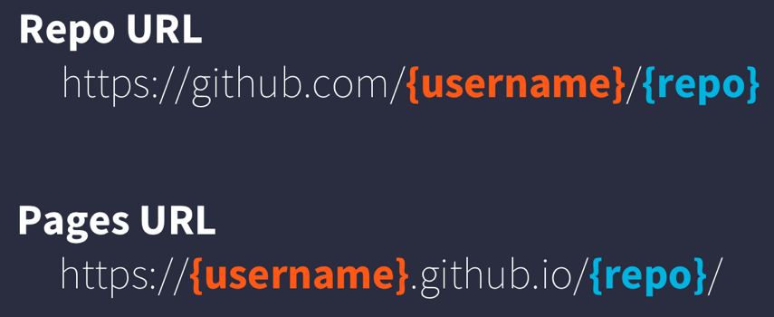

:::{.callout-learning}
After completing this session, you will be able to:

- Publish a Quarto analysis to the web using Git and GitHub Pages
- Create a multi-page site with a landing page that correctly links to a content page
- Add interactive tables and maps to an HTML document using `DT` and `leaflet`
- Follow the complete author → render → commit → push → verify publishing workflow
:::

## Introduction

Everything you've done so far using R -- your wrangled data and visualizations -- lives on your laptop. This session changes that: we'll take the analysis you built in the previous lesson and publish it as a live, interactive website anyone can visit by URL.

Quarto's HTML output format unlocks capabilities that static formats (PDF, Word) can't match:

- **Interactive plots** you can zoom, hover, and filter (you already made one with `ggplotly`)
- **Sortable, searchable tables** that let readers explore data directly in the browser
- **Interactive maps** readers can pan, zoom, and click

These elements are powered by JavaScript libraries (`plotly.js`, `DataTables`, and `Leaflet.js`) that R packages `ggplotly()`, `DT`, and `leaflet` make it easy for you to use in R. They work because web browsers run JavaScript; HTML is the right output format when you want to share interactive analyses.

::: callout-note
## A published example

[Here](https://pages.github.nceas.ucsb.edu/NCEAS/sasap-data/language_vis.html) is an example of a published data analysis site built with these same tools. Notice the interactive maps, the clean landing page, and how individual analyses are linked from it. That is the structure we will build today.
:::

## Set Up GitHub Pages

::: {.callout-note}
## Steps

1. Make sure you are in your `training_{USERNAME}` project

2. Create a new Quarto document called `index.qmd` at the top level of your project
    a. File → New File → Quarto Document
    b. Set the title (e.g., `"Delta Socioecological Monitoring"`), keep Default Output Format as HTML, click OK
    c. If your IDE added default template content below the YAML header, delete it
    d. Add a brief description and a placeholder for your analyses:

    ```markdown
    Welcome to my Delta socioecological monitoring analysis.

    ## Course Analyses

    - Data Visualization (link coming soon)
    ```

3. Save as `index.qmd`. Be sure to use this exact name, all lowercase. Web servers return `index.html` by default when no specific file is requested, so this name matters.

4. Render `index.qmd` and observe the new `index.html` in the same directory

5. Commit both `index.qmd` and `index.html` with a descriptive message, and push to GitHub
    - If an `index_files/` folder appears, commit it too -- it holds supporting files for the HTML

6. In your browser, go to your GitHub repo → Settings → Pages
    a. Keep Source as "Deploy from a branch"
    b. Change Branch from "None" to `main`, keep folder as `/ (root)`, click Save
    c. The message changes to "Your GitHub Pages site is currently being built from the `main` branch"

:::

GitHub Pages follows a URL convention based on your username and repository name:

{fig-alt="GitHub Pages URL pattern showing the change from github.com to github.io"}

Note that it changes from **github.com** to **github.io**.

- Visit `https://{username}.github.io/{repo_name}/` (note the trailing `/`)
- It may take a minute or two on first setup; refresh if you get a 404 error

Now make a small edit to confirm the full publish cycle works:

::: {.callout-note}
## Update your published page

- Add the text "Under construction" somewhere in `index.qmd`
- Render `index.qmd`
- Git workflow: Stage → Commit → Pull → Push
- Wait ~1 minute, then revisit `https://{username}.github.io/{repo_name}/` and confirm the change appears

:::

## Resources

*(Coming soon)*
